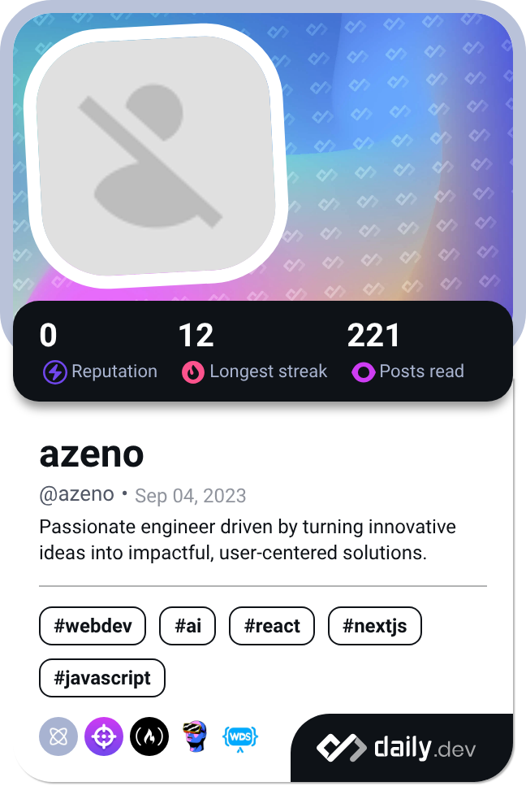

<h1 align="center">
  
</h1>

<p align="center">
  <a href="https://app.daily.dev/azeno"></a>
  &nbsp;
  <a href="https://www.buymeacoffee.com/ahmedzeno"></a>
  &nbsp;
  
</p>

<p align="center">
I'm passionate about transforming innovative ideas into impactful solutions, crafting technology that not only functions beautifully but also enriches people's lives. Currently a software engineer at <a href="https://www.collect.ai" target="_blank">Collect.AI</a> — previously at <a href="https://epilot.cloud" target="_blank">ePilot</a>, <a href="https://quantilope.com" target="_blank">Quantilope</a>, and <a href="https://goodgamestudios.com" target="_blank">GoodGames Studios</a> across Germany, UAE, Kuwait and Qatar. Exploring serverless architectures, distributed systems, and AI — always excited to learn and create.
</p>

---

<h3 align="left">🚀 Languages & Tools</h3>

<p><b>💻 Languages</b></p>
<p></p>

<p><b>🎨 Frontend</b></p>
<p></p>

<p><b>⚙️ Backend</b></p>
<p></p>

<p><b>🗄️ Databases</b></p>
<p></p>

<p><b>☁️ Cloud & DevOps</b></p>
<p></p>

<p><b>🤖 AI & Machine Learning</b></p>
<p>
  
  &nbsp;
  
  
  
  
</p>

<p><b>🧪 Testing</b></p>
<p></p>

<p><b>🛠️ Tools & Design</b></p>
<p></p>

---

<!--START_SECTION:waka-->

```txt
Total Time: 15 hrs 21 mins

TypeScript   13 hrs 18 mins  █████████████████████▓░░░   86.43 %
YAML         59 mins         █▓░░░░░░░░░░░░░░░░░░░░░░░   06.43 %
JavaScript   55 mins         █▒░░░░░░░░░░░░░░░░░░░░░░░   05.98 %
MDX          7 mins          ▒░░░░░░░░░░░░░░░░░░░░░░░░   00.79 %
Other        2 mins          ░░░░░░░░░░░░░░░░░░░░░░░░░   00.30 %
```

<!--END_SECTION:waka-->

---

## 🏆 GitHub Trophies

[](https://github.com/ryo-ma/github-profile-trophy)

---

| GitHub Stats | GitHub Streak | Top Languages |
| :---: | :---: | :---: |
|  |  |  |

---

[](https://github.com/ashutosh00710/github-readme-activity-graph)

---

<picture>
  <source media="(prefers-color-scheme: dark)" srcset="https://raw.githubusercontent.com/jadzeino/jadzeino/output/github-contribution-grid-snake-dark.svg">
  <source media="(prefers-color-scheme: light)" srcset="https://raw.githubusercontent.com/jadzeino/jadzeino/output/github-contribution-grid-snake.svg">
  
</picture>

---

<table>
  <tr>
    <td width="50%">
      <div align="center">
        <a href="https://app.daily.dev/azeno">
          
        </a>
      </div>
    </td>
    <td width="50%">
      <div align="center" style="margin-bottom: 20px;">
        <strong>Here are some jokes to change your mood 😄</strong>
      </div>
      <div>
        
        
        
      </div>
    </td>
  </tr>
</table>

---

<p align="center">
  <a href="https://www.buymeacoffee.com/ahmedzeno" target="_blank" rel="noreferrer nofollow">
    
  </a>
</p>
